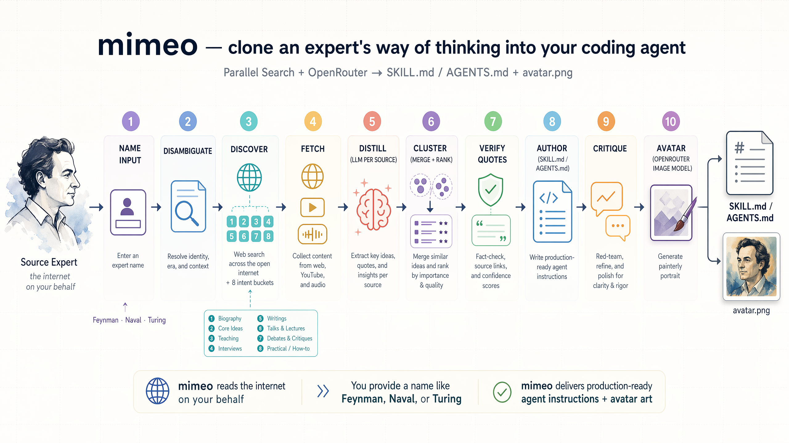

<div align="center">

# mimeo-zh

**把一位专家的思考方式，克隆进你的 AI Agent。**

> *mim·e·o* ｜ 拷贝 · 复制 · 临摹

一句命令，把段永平 / 但斌 / 李录 / 费曼 / 巴菲特的公开思考，
自动蒸馏成一份可被 Claude Code、Codex、Cursor 直接加载的中文
`SKILL.md` / `AGENTS.md`。

[English](#english-tldr) ·
[快速开始](#30-秒跑通) ·
[样例输出](#已经做出了什么真实样例) ·
[CLI 参数](#所有-cli-参数) ·
[致原作者](#致谢)



</div>

---

## 30 秒跑通

```bash
# 1. 克隆 + 装依赖
git clone https://github.com/CyAlcher/mimeo-main-zh.git
cd mimeo-main-zh && uv sync

# 2. 填 .env（复制 .env.example 即可）
cp .env.example .env
# 编辑 .env 填入 DEEPSEEK_API_KEY 和 PARALLEL_API_KEY

# 3. 跑一位专家
uv run mimeo "段永平" --provider deepseek --format both
```

产物：`output/duan-yongping/SKILL.md` + `references/` + `avatar.png`，
可直接被 Claude Code / Codex / Cursor 加载。

---

## 它是什么

每个领域都有人用一辈子在公开思考：费曼之于物理第一性原理、达尔文之于
观察与慢假设、图灵之于计算与形式证明；投资领域则有巴菲特、芒格，
以及**段永平、但斌、李录**这三位被称为"中国价值投资代表"的华人长期
主义者。

他们的演讲、访谈、股东信、财报解读里藏着真正好用的**心智模型**。
问题是没人有时间把它们读完、消化、再稳定地用到自己的决策里。

而 AI Agent 对这种级别的指导非常饥渴——一份写得好的 `SKILL.md` 或
`AGENTS.md` 就是一根杠杆，它会重塑 Agent 的默认推理方式。但手写一份
这样的资料本身是多周的工程：读、综述、蒸馏、校验。

**mimeo-zh 把这件事自动化了。** 给它一个人名，它会：

1. 自动上网读公开材料（文章、演讲、访谈、播客、书籍）
2. 用前沿大模型逐段蒸馏出原则 / 框架 / 心智模型 / 金句 / 反模式
3. 跨来源聚类合并、按频次排序
4. 对每条"原话"逐一模糊核验，对不上的扔掉
5. 产出**可直接加载**的中文 `SKILL.md` 或 `AGENTS.md`

---

## 三个核心卖点

<table>
  <tr>
    <td width="33%" valign="top">
      <h3>1. 产物即插即用</h3>
      输出严格符合 <a href="https://github.com/anthropics/skills">Anthropic skill-creator</a> 规范：一份 <code>SKILL.md</code> + <code>references/</code> 子目录。放进 Claude Code / Codex 的 skills 目录，重启即可触发。不需要二次加工。
    </td>
    <td width="33%" valign="top">
      <h3>2. 国产 LLM 直连</h3>
      原生支持 DeepSeek 官方 API（<code>--provider deepseek</code>），国内网络友好、价格友好。默认 <code>deepseek-chat</code>，推理重的场景切 <code>deepseek-reasoner</code>。OpenRouter 路由仍然保留。
    </td>
    <td width="33%" valign="top">
      <h3>3. 原生中文输出</h3>
      所有文档、提示词、日志、评审报告、产物全部中文化，并强制模型以简体中文生成 <code>SKILL.md</code>、<code>AGENTS.md</code>、<code>references/*.md</code>；人名、公司、英文书名保留原文。
    </td>
  </tr>
</table>

---

## 已经做出了什么（真实样例）

这不是空口白话。仓库 `output/` 目录下已跑通 **2 位中国价值投资家**的
完整 Skill，直接可读：

### 但斌 · `output/dan-bin/SKILL.md`

> **投资改变世界或不被世界改变的公司**：聚焦于两类公司——能主动
> 改变世界的创新企业（如英伟达、苹果），以及因其文化或品牌韧性而
> 不易被世界改变的企业（如茅台、爱马仕）。

> **护城河是根本判断依据**：价值投资的根本判断依据是企业的护城河，
> 要足够深足够宽。护城河深宽的企业能保持竞争优势，长期创造价值。

完整 10 条原则 + `references/principles.md` + `references/frameworks.md`
+ `references/mental-models.md` + `references/quotes.md` 见
[`output/dan-bin/`](./output/dan-bin/)。

### 李录 · `output/li-lu/SKILL.md`

> **股票是公司所有权**：股票代表对公司的部分所有权，而非投机筹码。

> **市场是工具而非老师**：市场只能告诉你价格，不能告诉你价值。

完整四大基石 + 能力圈 + 安全边际推理链见
[`output/li-lu/`](./output/li-lu/)。

### 段永平

命令模板已就绪见
[`examples/china-value-investors.md`](./examples/china-value-investors.md)，
`uv run mimeo "段永平" --provider deepseek --format both` 即可复现。

---

## 安装

```bash
# uv（推荐）
uv sync

# 或 pip
pip install -e .

# 如需转写播客音频（可选、更慢更重）
uv sync --extra full
```

把 `.env.example` 复制成 `.env` 并填上字段：

```env
# 使用 DeepSeek（国内推荐）
MIMEO_PROVIDER=deepseek
DEEPSEEK_API_KEY=sk-...
PARALLEL_API_KEY=...

# 或使用 OpenRouter
# MIMEO_PROVIDER=openrouter
# OPENROUTER_API_KEY=sk-or-...
# PARALLEL_API_KEY=...
```

---

## 基本用法

```bash
# 走 DeepSeek 官方 API（国内推荐）
uv run mimeo "段永平" --provider deepseek --model deepseek-chat

# 走 OpenRouter（需要能直连）
uv run mimeo "Naval Ravikant" --provider openrouter
```

---

## 开箱即用的中国投资家示例

> 这 3 条是**中文版新增**，不替换原项目的任何示例。

```bash
# 段永平 —— 步步高/OPPO/vivo 创始人；国内"价值投资布道者"
uv run mimeo "段永平" \
  --provider deepseek \
  --model deepseek-chat \
  --disambiguator "步步高/OPPO/vivo 创始人，网易等公司早期重要投资人" \
  --format both

# 但斌 —— 东方港湾董事长，长期主义实践者
uv run mimeo "但斌" \
  --provider deepseek \
  --model deepseek-chat \
  --disambiguator "东方港湾投资管理公司董事长，价值投资与长期持有倡导者" \
  --max-sources 30

# 李录 —— Himalaya Capital 创始人，芒格最看重的华人投资人
uv run mimeo "李录" \
  --provider deepseek \
  --model deepseek-reasoner \
  --disambiguator "Himalaya Capital 创始人，芒格的长期合作者，《文明、现代化、价值投资与中国》作者" \
  --deep-research
```

更细的三人对照版提示词与说明见
[`examples/china-value-investors.md`](./examples/china-value-investors.md)。

---

## 流水线

0. **身份消歧**：用 Parallel Search + 一次 LLM 分类，防止"张三"在
   经济学家、篮球教练和作家之间被拼成一个四不像。
1. **来源发现**：通过 [Parallel](https://parallel.ai) Search API 在
   八个意图桶（文章、演讲、访谈、播客、框架、书籍、论文、信件）里
   广撒网，现代操盘手和历史科学家都能覆盖。
2. **内容抓取**：网页走 Parallel 摘要/正文提取；YouTube 走
   `youtube-transcript-api`；可选的本地 Whisper 能转写播客音频。
3. **单源蒸馏**：走 OpenRouter 或 DeepSeek 官方 API（由
   `--provider` 决定）做结构化抽取——原则、框架、心智模型、金句、
   经验法则、反模式。超长材料按段落切块并行蒸馏后再合并，避免
   "默默被截断"。
4. **聚类合并**：跨来源合并同义概念、按频次排序。语料太大时按预算
   分批聚类再内存合并。
5. **引文核验**：把每条 representative_quote 与已抓取的源文本做模糊
   匹配，对不上的删掉并写进 `_workspace/quote_verification.md` 审计
   日志。`--no-verify-quotes` 关闭。
6. **著作**：写 SKILL 及可选的 AGENTS.md，并产出 `heuristics.md`、
   `anti-patterns.md` 等 reference 文件，全部中文。
7. **对抗式评审**：再跑一轮"对抗式编辑"LLM，把 0-10 打分和分类问题
   清单写入 `_workspace/critique_skill.md`。只诊断、不自动改写。
   `--no-critique` 关闭。
8. **画像头像**：用 OpenRouter 的图像模型产一张油画风头像，保存为
   `avatar.png`。尽力而为，失败会被日志吞掉。`--no-avatar` 关闭。

---

## 所有 CLI 参数

| 参数 | 默认值 | 说明 |
|------|--------|------|
| `--provider {openrouter,deepseek}` | `openrouter` | LLM 服务商；`deepseek` 直连官方 API，国内推荐 |
| `--model SLUG` | 取决于 provider | provider=deepseek 时默认 `deepseek-chat`；provider=openrouter 时默认 `google/gemini-3.1-pro-preview` |
| `--format {skill,agents,both}` / `-f` | `skill` | 输出形态 |
| `--mode {text,captions,full}` | `captions` | 抓取深度 |
| `--max-sources N` | `25` | 保留的最大来源数 |
| `--deep-research` | 关 | 额外跑一次 Parallel 深度研究并合入 |
| `--disambiguator TEXT` / `-d` | 自动 | 同名人消歧短描述；设置后跳过自动消歧 |
| `--assume-unambiguous` | 关 | 完全跳过身份消歧（非交互脚本用） |
| `--output-dir PATH` | `./output` | 输出根目录 |
| `--refresh` | 关 | 忽略 `_workspace/` 下缓存，全量重跑 |
| `--concurrency N` | `5` | 单源蒸馏并发数 |
| `--verify-quotes / --no-verify-quotes` | 开 | 著作前逐条核验 representative_quote |
| `--critique / --no-critique` | 开 | 著作后做对抗式评审 |
| `--avatar / --no-avatar` | 开 | 生成油画风头像 |
| `--avatar-model SLUG` | `openai/gpt-5.4-image-2` | 头像模型 slug |

---

## 同名歧义

名字可能对应多位公众人物时，mimeo-zh 会先做消歧：

```bash
# 交互式：列出候选让你选
uv run mimeo "张三"

# 脚本式：一上来就钉死是哪位
uv run mimeo "段永平" -d "步步高/OPPO/vivo 创始人，网易投资人"

# 非交互且确信唯一：直接跳过
uv run mimeo "Charlie Munger" --assume-unambiguous
```

非 TTY 环境下如果没给 `--disambiguator`，mimeo-zh 会报错并列出候选。
结果缓存在 `_workspace/identity.<model>.json`，下次直接命中；
`--refresh` 可以让缓存失效。

---

## 输出目录结构

`--format skill`（默认）：

```
output/duan-yongping/
├── SKILL.md
├── references/
│   ├── principles.md
│   ├── frameworks.md
│   ├── mental-models.md
│   ├── heuristics.md
│   ├── anti-patterns.md
│   ├── quotes.md
│   └── sources.md
├── avatar.png
└── _workspace/
```

`--format agents`：

```
output/duan-yongping/
├── AGENTS.md
├── avatar.png
└── _workspace/
```

`--format both`：两类产物共存；discovery/fetch/distill/cluster 缓存共享
（头像也只生成一次），第二类产物几乎是"白送"。

---

## 架构

```
cli -> pipeline -> identity   （Parallel 搜索 + LLM：是否歧义、选哪一位）
                -> discovery  （Parallel 搜索，8 意图桶）
                -> fetch      （网页 / YouTube / 可选音频）
                -> distill    （逐源抽取，超长材料切块合并）
                -> research?  （Parallel 深度研究伪来源）
                -> cluster    （跨源合并 + 排名，过大语料分批）
                -> verify?    （逐条引文模糊匹配）
                -> author     （skill / agents / both）-> writers
                -> critique?  （对抗式评审 -> _workspace/critique_*.md）
                -> avatar?    （OpenRouter 图像模型 -> avatar.png）
```

---

## 本地联通性测试

`scripts/test_deepseek.py` 用 `.env` 里的 `DEEPSEEK_API_KEY` 走一次
最短调用：

```bash
uv run python scripts/test_deepseek.py
```

返回 `✅ DeepSeek 正常` 表示凭证、网络、默认模型都能跑通。

---

## 路线图

- [x] DeepSeek provider 原生支持
- [x] 全链路中文化（文档 / 提示词 / 日志 / 产物）
- [x] 中国价值投资者样例（但斌、李录已 ship，段永平命令模板就绪）
- [ ] 增补更多中文长期主义者（芒格中文圈子、张磊、冯柳）
- [ ] 为每份 SKILL 生成配套的「30 秒视频脚本」，方便社交传播
- [ ] GitHub Action：推 PR 时自动对 `output/**/SKILL.md` 做轻量 lint

欢迎在 Issues 里投票最想看的下一位。

---

## 参与共建

- **提 Issue**：发现 bug、有想克隆的人物、输出质量不对劲都欢迎
- **提 PR**：小到改错别字、补一段消歧描述、加一条示例命令都欢迎
- **贡献样例**：如果你用 mimeo-zh 跑出了质量不错的 `SKILL.md`，
  可以 PR 到 `output/` 下，注明用了哪组参数

本项目沿用原作者 MIT 协议；代码结构与核心算法保持与原项目一致，
改造范围限于文档 / 提示词 / 日志 / DeepSeek 入口 / 中国价投示例。

---

## 关注作者

左边是**公众号**，更新项目动态与 AI × 投资副驾的实战内容；
右边是**个人微信**，交流、反馈、提 bug、求样例都欢迎。

<table>
  <tr>
    <td align="center">
      <br>
      <sub>微信公众号</sub>
    </td>
    <td align="center">
      <br>
      <sub>个人微信（交流 / 反馈）</sub>
    </td>
  </tr>
</table>

---

## English TL;DR

**mimeo-zh** is the Chinese-localized fork of
[K-Dense-AI/mimeo](https://github.com/K-Dense-AI/mimeo) — a tool that
clones an expert's public thinking into an `AGENTS.md` / `SKILL.md`
your AI agent can load directly.

On top of the original:

- Native **DeepSeek** provider (`--provider deepseek`) for friendly
  latency & pricing inside China.
- All prompts, logs, reviews, and generated artifacts forced to
  Simplified Chinese (names / companies / English book titles kept as-is).
- Pre-wired command templates for 3 Chinese value-investing icons:
  **Duan Yongping**, **Dan Bin**, **Li Lu**.

Everything else (Parallel search, quote verification, adversarial
critique, avatar generation) behaves exactly as upstream.

> Topics suggested for GitHub repo settings:
> `agents-md` `skill-md` `ai-agents` `claude-code` `codex-cli`
> `deepseek` `value-investing` `knowledge-distillation`
> `prompt-engineering` `chinese-nlp`

---

## 许可证

本项目沿用原作者 MIT 协议，不做任何修改。见 [LICENSE](./LICENSE)。
原项目主页：<https://github.com/K-Dense-AI/mimeo>。
中文版所做的修改全部在本仓库（`mimeo-main-zh`）内完成，不牵扯对原
仓库的任何侵权主张，特此声明。

---

## 致谢

- 原项目 [K-Dense-AI/mimeo](https://github.com/K-Dense-AI/mimeo) 的
  架构与流水线设计是本项目的基石；中文版仅做本地化与国产 LLM 适配。
- 段永平、但斌、李录三位长期写作/访谈公开记录的坚持，让国内价值投资
  社区受益良多。
- 本仓库 README 结构优化参考了
  [CyAlcher/ai_native_a_stock_agent](https://github.com/CyAlcher/ai_native_a_stock_agent)
  的展示方式。
